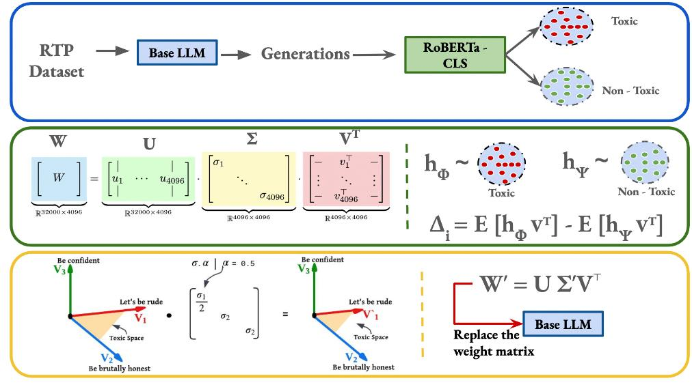

# EigenShift: Eigen-based Intervention for Toxicity Reduction in LLMs 
 


> ⚡ A novel principled intervention technique for reducing toxicity in Large Language Models without compromising linguistic competence

## 📋 Abstract

Large Language Models have demonstrated impressive fluency across diverse tasks, yet their tendency to produce toxic content remains a critical challenge for AI safety and public trust. Existing toxicity mitigation approaches primarily manipulate individual neuron activations, but these methods suffer from instability, context dependence, and often compromise the model’s core language abilities. To address these shortcomings, we investigate three key questions: the stability of neuron-level toxicity indicators, the advantages of structural (layer-wise) representations, and the interpretability of mechanisms driving toxic generation. Through extensive experiments on Jigsaw and ToxiCN datasets, we show that aggregated layer-wise features provide more robust signals than single neurons. Moreover, we observe conceptual limitations in prior works that conflate toxicity detection experts and generation experts within neuron-based interventions. To mitigate this, we propose a novel principled intervention technique, EigenShift, based on eigen-decomposition of the language model’s final output layer. This method selectively targets generation-aligned components, enabling precise toxicity suppression without impairing linguistic competence. Our method requires no additional training or fine-tuning, incurs minimal computational cost, and is grounded in rigorous theoretical analysis.

🔍 **Key Research Questions:**
- The stability of neuron-level toxicity indicators
- The advantages of structural (layer-wise) representations  
- The interpretability of mechanisms driving toxic generation

Through extensive experiments on Jigsaw and ToxiCN datasets, we show that aggregated layer-wise features provide more robust signals than single neurons. We propose **EigenShift**, based on eigen-decomposition of the language model's final output layer, which selectively targets generation-aligned components for precise toxicity suppression.

## 🏗️ Architecture Overview


For more detailed methodology please go though our paper.

## ✨ Key Features

- 🎯 **No Additional Training**: Zero fine-tuning required
- ⚡ **Minimal Computational Cost**: Efficient intervention mechanism
- 🧠 **Theoretically Grounded**: Based on rigorous mathematical analysis
- 🛡️ **Preserves Language Abilities**: Maintains core linguistic competence
- 🔧 **Easy Integration**: Simple plug-and-play solution

## 🛠️ Installation & Setup

### Step 0: Environment Setup 🐍

Create and activate a virtual environment using Python 3.8.10:

```bash
# Create virtual environment
python3.8 -m venv venv

# Activate environment
source venv/bin/activate  # Linux/Mac
# OR
.\venv\Scripts\activate   # Windows

# Install dependencies
pip install -r requirements.txt
```

## 📊 Pipeline Overview

```
🔄 Step 1: Generate Model Outputs
    ⬇️
🔍 Step 2: Extract Toxic Words  
    ⬇️
🧮 Step 3: Matrix Reconstruction (Core Intervention)
    ⬇️  
📈 Step 4: Evaluation After Intervention
```

---

## 🎮 Step 1: Generate Outputs from Model

Navigate to the generation script:

```bash
cd EigenShift
python get_generations.py
```

### ⚙️ Configuration Required:
Before running, update these parameters in `get_generations.py`:
- `model_name` 🏷️
- Hugging Face token 🔑
- Device (`"cuda"` or `"cpu"`) 💻

### 📁 Output Location:
```
EigenShift/generations/wo-intervention/
```

### 📦 Pre-generated Data Available:
We've included pre-generated outputs for convenience:
```
EigenShift/generations/wo-intervention/LLaMA-2-7b-hf_RTP_generations.json
```
*Contains 5000 toxic generations from LLaMA 2 7B using RealToxicPrompts (RTP)*

---

## 🔍 Step 2: Extract Toxic Words

Uses pre-trained toxicity classifier (`s-nlp/roberta_toxicity_classifier`) to identify toxic content:

```bash
python toxic_words_extraction.py
```

### 🎯 What This Does:
- Analyzes generated text for toxic content
- Extracts and categorizes toxic words
- Prepares data for intervention pipeline

### 📊 Pre-processed Output Available:
```
EigenShift/generations/wo-intervention/LLaMA-2-7b-hf_RTP_generations_roberta_toxic_words_extraction.csv
```

---

## 🧮 Step 3: Intervention via Matrix Reconstruction ⭐

**This is the core EigenShift methodology!**

```bash
python reconstruct.py
```

### 🔬 Process Breakdown:

1. **🏗️ Build Clusters**
   - Creates toxic/non-toxic hidden state clusters
   - Analyzes activation patterns

2. **📐 Matrix Factorization** 
   - Applies SVD (Singular Value Decomposition) on `lm_head`
   - Decomposes weight matrix into eigencomponents

3. **📍 Projection Analysis**
   - Projects hidden states onto eigenvectors
   - Maps toxicity patterns to mathematical space

4. **📊 Delta Score Computation**
   - Computes toxicity alignment scores
   - Identifies intervention targets

5. **🎛️ Selective Dampening**
   - Dampens eigenvectors based on toxicity scores
   - Reconstructs optimized `lm_head` matrix

### 🧠 Mathematical Foundation:
The intervention leverages eigen-decomposition to:
- Target generation-aligned components specifically
- Preserve linguistic competence while reducing toxicity
- Provide interpretable intervention mechanisms

---

## 📈 Step 4: Evaluate After Intervention

Replace the original `lm_head` with reconstructed version and evaluate:

```bash
python evaluation_after_intervention.py
```

### 📋 Evaluation Process:
- Loads model with reconstructed `lm_head`
- Tests on RealToxicPrompts (RTP) dataset
- Measures toxicity reduction vs. linguistic preservation
- Generates comprehensive performance metrics

---

## 📊 Baselines & Comparisons

For comparison against baseline methods, we used the official implementation from:

🔗 **Reference Implementation:** [Apple ML-AURA](https://github.com/apple/ml-aura)

### 🏆 Performance Highlights:
- Superior stability compared to neuron-level interventions
- Better context independence
- Maintained linguistic competence
- Robust across different datasets (Jigsaw, ToxiCN)


---

## 🎯 Key Advantages
| Feature | Traditional Methods | EigenShift |
|---------|-------------------|------------|
| **Stability** | ❌ Context-dependent | ✅ Robust across contexts |
| **Training** | 🔄 Requires fine-tuning | ✅ Zero additional training |
| **Interpretability** | ❓ Limited insights | 🔍 Clear mathematical basis |
| **Language Preservation** | ⚠️ Often compromised | ✅ Maintained competence |
| **Computational Cost** | 💰 High | 💡 Minimal overhead |

---

## 🚀 Quick Start Guide

1. **🔧 Setup Environment**
   ```bash
   python3.8 -m venv venv && source venv/bin/activate
   pip install -r requirements.txt
   ```

2. **🎮 Run Full Pipeline**
   ```bash
   cd EigenShift
   python get_generations.py
   python toxic_words_extraction.py  
   python reconstruct.py
   python evaluation_after_intervention.py
   ```

3. **📊 Analyze Results**
   - Check output files in `generations/` directory
   - Review evaluation metrics
   - Compare with baseline methods

---


## 📖 Citation

If this work is helpful in your research, please cite:

```bibtex
soon
```

---
This project is licensed under [License Type] - see the LICENSE file for details.

---

*🌟 Made with passion for AI Safety and Responsible AI Development*
